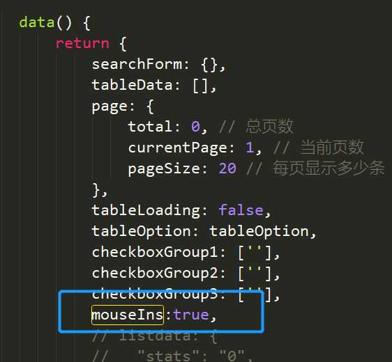

# 组件传值

## 父组件向子组件传值

#### **父组件中：**



##### **1.**定义一个变量，可以为 **数组** **对象** **字符串** 等

##### **2.**引入子组件（[如果忘记了点击这](#组件引用)），并在子组件中传入以上变量

```vue
<card-item :page-data="o" 
           :mouseIns="mouseIns"  <!-- 是这个哦，现在讲解的 -->
           @showCityName="updateCity" 
           @Dcollection="Dcollection" 
           @Scollection="Scollection" 
           @doNow="doNow"></card-item>
```

其中   ：

:mouseIns="mouseIns" 将父组件的mouseIns传递给子组件mouseIns

```
:子组件接收的变量名称="父组件变量名称"
```

#### **子组件中**

##### **3.**子组件应用

子组件需要使用父组件传过来的值，那么就需要一个接收的变量，使用 **props** 来定义接收的变量

```javascript
    props: {
      mouseIns: false 这个就是
    },
```

 数组和简写  dats:String 表示传输的是一个字符串类型的数值

使用的话可直接使用，就像在自己的页面一样

```vue
<div v-show="mouseIn" class="transition-box"></div>
```

如果是对象或者数组

```vue
 props: {
      pageData: {}
}
```

```vue
<el-link @click="fab(pageData.id)" v-if="pageData.status==0" icon="el-icon-s-promotion">发布</el-link> 
<el-link @click="wfab(pageData.id)" v-else-if="pageData.status==1" icon="el-icon-s-promotion">停用</el-link>
```

```json
[
    {
        "createBy": "opeadmin",
        "createTime": "2022-06-17 16:35:08",
        "updateBy": "opeadmin",
        "updateTime": "2022-06-21 12:43:31",
        "id": "1537715453571649538",
        "key": "ddb87951f1ba4acea872b1119978aa93",
        "name": "",
        "categoryId": null,
        "status": 1,
        "desc": "",
        "image": "",
        "templateType": null,
        "fork": 0,
        "isCollection": false
    }
    
]
```

```vue
console.log(pageData.id)     =>>>   1537715453571649538
console.log(pageData.status)     =>>>   1
```


##  子组件调用父组件的函数

#####  第一步：

在子组件中添加函数，可以使用 **@click** 触发函数

```vue
<el-link @click="fab(pageData.id)" v-if="pageData.status==0" icon="el-icon-s-promotion">发布</el-link>
```

```javascript
fab(val){ // val就是上面点击后触发函数传过来的pageData.id
let data ={ //自定义的对象
	status:1, //针对这个一个，status是后端接口需要的（改变状态的接口）
	id:val // 传输过来的id
	};
this.$emit('release',data); //通过$emit传值到父组件 
},
```

this.$emit(**'父组件中接收数值的函数名称','需要传输的数值'**); 

##### 第二步：

在父组件中添加或者明确要的函数比如updateCity，如果要接收子组件的值就加上参数就行

```javascript
release(data){ //用以接收子组件传值的函数，与子组件中指定的函数名称要一致
    release_disable(data).then(data => { //axios 执行成功后的操作
        this.$message({ // element-ui弹窗
            type:'success',
            message:'发布成功'
        });
        this.getList(this.page) // 
        console.log(data.id)
    })
},
```


#####  第三步：

在子组件引用区域添加@release="release"

```vue
<card-item @release="release"></card-item> // @子组件函数名=“父组件函数名” 
```

[可参考](https://blog.csdn.net/sllailcp/article/details/78595077)

## 组件引用

先写好组件

在通过

```javascript
import cardItem from '@/components/mob/card-item' //引入组件
export default {
    components: {
        cardItem //声明使用组件
    },
}
```

使用一般按照驼峰命名使用

```vue
<card-item></card-item>
```


## 表格可编辑

```vue
<el-dialog title="编辑分类" :visible.sync="dialogVisible" center>
    <div style="align-items: center;justify-content: center;">
        <span>
            <el-input v-model="privateadd.name" style="width: 50%;" placeholder="请输入需要添加分类的名称"></el-input><span>
            <el-button @click="addprivat()" type="primary" icon="el-icon-plus">新增分类</el-button>
            </span>
        </span>
        <el-table :data="privateList" max-height="250" v-loading="tableLoading">
            <el-table-column prop="id" label="ID">
            </el-table-column>
            <el-table-column prop="name" label="名称">
                <template slot-scope="scope">
<span v-if="scope.$index==curIndex">
    <el-input v-model="scope.row.name" size="small" />
                    </span>
<span v-else>{{ scope.row.name }}</span>
                </template>
            </el-table-column>
            <el-table-column label="操作">

                <template slot-scope="scope">

<el-tooltip v-if="curIndex==scope.$index" effect="dark" content="保存" placement="top">
    <el-button @click="privateEdit(scope.row)" size="mini" type="danger" icon="el-icon-check" circle>
                    </el-button>
                    </el-tooltip>
<el-tooltip v-else effect="dark" content="编辑" placement="top">
    <el-button @click="curIndex=scope.$index" size="mini" type="primary" icon="el-icon-edit" circle>
                    </el-button>
                    </el-tooltip>
<el-tooltip effect="dark" content="删除" placement="top">
    <el-button size="mini" type="danger" icon="el-icon-delete" circle></el-button>
                    </el-tooltip>
                </template>
            </el-table-column>
        </el-table>
    </div>
    <span slot="footer" class="dialog-footer">
        <el-button @click="dialogVisible = false">关闭</el-button>
        <!-- <el-button type="primary" @click="confirmDelete()">确定</el-button> -->
    </span>
</el-dialog>

<scrpt>
    data() {
    	return {
    		curIndex: -1,
    	}
    }
</scrpt>
```


```jso
{
    "name": "是多少",
    "region": "shanghai",
    "date1": "2022-06-27T16:00:00.000Z",
    "date2": "2022-06-21T07:33:05.000Z",
    "delivery": true,
    "type": [
        "地推活动"
    ],
    "resource": "线下场地免费",
    "desc": "是的"
}
```

# 其他小技巧

## 组件刷新

简单来说就是隐藏后在显示

```vue

<template>
<comp v-if="update"></comp>
<button @click="reload()">刷新test1组件</button>
</template>
<script>
    import comp from '@/views/comp.vue'
    export default {
        name: 'test1',
        data() {
            return {
                update: true
            }
        },
        methods: {
            reload() {
                // 移除组件
                this.update = false
                // 在组件移除后，重新渲染组件
                // this.$nextTick可实现在DOM 状态更新后，执行传入的方法。
                this.$nextTick(() => {
                    this.update = true
                })
            }
        }
    }
</script>
```

## ref

[可以调用子组件的data和方法](https://blog.csdn.net/qq_41929578/article/details/122671455)

## 数组

### 组成新数组

#### map

使用map可以将一个对象组成一个新的数组，可以自定义需要的字段比如，某个需要id和name两个字段

```json
privateListdata：{

id:"",

name:""

}
```

```json
let a ={

    "createBy": "user",

    "createTime": "2022-06-22 17:36:41",

    "updateBy": "user",

    "updateTime": "2022-06-22 17:36:41",

    "id": "1539542879935139842",

    "name": "test01",

    "userId": "1536910548602818562"

}
```

```javascript
this.privateListdata = a.map(item => {
    return {name:item.name,
            id:item.id}
})
```

#### concat合并数组

```javascript
var arr = new Array(3)
arr[0] = "George"
arr[1] = "John"
arr[2] = "Thomas"

var arr2 = new Array(3)
arr2[0] = "James"
arr2[1] = "Adrew"
arr2[2] = "Martin"

var arr3 = new Array(2)
arr3[0] = "William"
arr3[1] = "Franklin"

arr.concat(arr2,arr3)

输出：
George,John,Thomas,James,Adrew,Martin,William,Franklin
```


## elementui组件

### 复选框checkbox 全选功能

如果使用的数据源是对象，那么全选是不能使用的，因为全选的原理是将选项的值赋值给选择的数组，是一个数组，那么需要的是

**：value** 的值

```javascript
const all = this.privateListdata.map(item => {
    return item.id   //不明白为什么是id
})
this.privateList_choose = val ? all : [], 
    //  这个是个if判断  相当于if(this.privateList_choose = val){
    //     this.privateList_choose=all
    // }
    // else
    //     {
    //         this.privateList_choose=[]
    //     }
```

### 选择器select

```vue
<el-dialog title="选择分类" :visible.sync="ClassifyDialog" width="30%">
    请选择归为的分类：<el-select
                        clearable
                        filterable
                        v-model="form"
                        placeholder="请选择分类"
                        style="width: 100%;padding-top: 10px;"
                        size="medium"
                        >
    <el-option v-for="classify in privateListdata" :key="classify.id" :label="classify.name" :value="classify.id"></el-option>
    </el-select>
    <div slot="footer" class="dialog-footer">
        <el-button @click="ClassifyDialog = false">取 消</el-button>
        <el-button type="primary" @click="ClassifyDialogSure(pageData.id,form),ClassifyDialog = false,reload()">确 定</el-button>
    </div>
</el-dialog>
```

 **v-model="form"** 是数据绑定，是一个字符串，可以作为一个对象使用

**form: {},**

这里还是一般用字符串

**form: ‘’,**

因为多选框我想要的是显示name输出id且要和点进去的id匹配

a:

```json
a:
[ { "id": "1539542879935139842", "name": "test01" }, 
 { "id": "1539542922071117825", "name": "test02" }, 
 { "id": "1539546291246469121", "name": "text03" },
 { "id": "1539546871352266753", "name": "text04" } ]

b: [
    {
        "pagesType": "1539542879935139842"
    }
],

```

需要将a中的**id**和b中的 **pagesType** 匹配输出a中的**id**这就需要将匹配到的name赋值给form

```java
let a = this.pageData
    let id = a.pagesType
    if(id){
        let b = this.privateListdata
            let ssform = b.filter(item =>item.id===id)
            this.form = ssform[0].name
    }
```

这里加了一个if判断，主要原因是如果pagestype为空那么就会报错，为空在本次业务中属于 **未分类** 所以为空，先将a、b分别赋值，最后使用filter过滤器，判断b里面的id是否等于a里面的id（因为a里面只有一个pagesType，所以写为id），最后将第0项赋值给form这样选择器就可以显示当前的选项或者分类

## 三元表达式

```javascript
{{detail.bizType=='01'?'手机号码' : detail.bizType=='02'?'集团产品虚拟号码':''}}
```

判断是否等于**01** 如果 **是** 显示 **‘手机号码’**  不是 则判断是否等于 **02**  如果 **是**  输出 **'集团产品虚拟号码'**  否则为空  后面的 **''** 必须写不然会报错

# 代码备份

## axios封装

在 **utils** 下创建 **request.js** 文件写入代码

```javascript
import axios from 'axios'
// axios.defaults.headers['Content-Type'] = 'application/json;charset=utf-8';
// axios.defaults.headers['Platform'] = 'web'
// 创建axios实例
const service = axios.create({
    // axios中请求配置有baseURL选项，表示请求URL公共部分
    baseURL : 'http://localhost:9090',
    // 超时
    timeout: 5000,
})

// 请求拦截器
service.interceptors.request.use(
    config => {
        // 让每个请求携带自定义token 请根据实际情况自行修改
        // config.headers['Authorization'] = token
        return config;
    },
    error => {
        console.log('err：' + error);
        return Promise.reject(error);
    }
)

// 响应拦截器
service.interceptors.response.use(
    response => {
        return response;
        // 未设置状态码则默认成功状态
        // const code = response.data.code || 200;
        // // 获取错误信息
        // const errorCode = {
        //     '401': '认证失败，无法访问系统资源',
        //     '403': '当前操作没有权限',
        //     '404': '访问资源不存在',
        //     'default': '系统未知错误,请反馈给管理员'
        // };
        // const msg = errorCode[code] || response.data.msg || errorCode['default'];
        // if (code === 500) {
        //     return Promise.reject(new Error(msg))
        // } else if (code !== 200) {
        //     return Promise.reject('error')
        // }else{
        //     return response.data
        // }
    },
    error => {
        console.log('错误：' + error);
        let { message } = error;
        if (message == "Network Error") {
            message = "后端接口连接异常";
        }
        else if (message.includes("timeout")) {
            message = "系统接口请求超时";
        }
        else if (message.includes("Request failed with status code")) {
            message = "系统接口" + message.substr(message.length - 3) + "异常";
        }
        return Promise.reject(message);
    }
)
export default service;
```

在单独封装各个页面的接口写入以下代码

```javascript
import request from '@/utils/request' // 引入封装的request.js文件
// 暴露出我们的接口请求,export导出
// 登录接口
export function quera(query) {
    return request({
        url: '/user/page',
        method: 'get',
        params: query
    })
}
```

在使用的页面通过import引入

```java
import {quera} from "@/api/home"
```

根据需要使用（传入的参数等）

```javascript
quera({pageNum: page.pageNum,pageSize:page.pageSize}).then(res=>{
    this.page.total = res.data.total
    this.tableData = res.data.records
})
```


