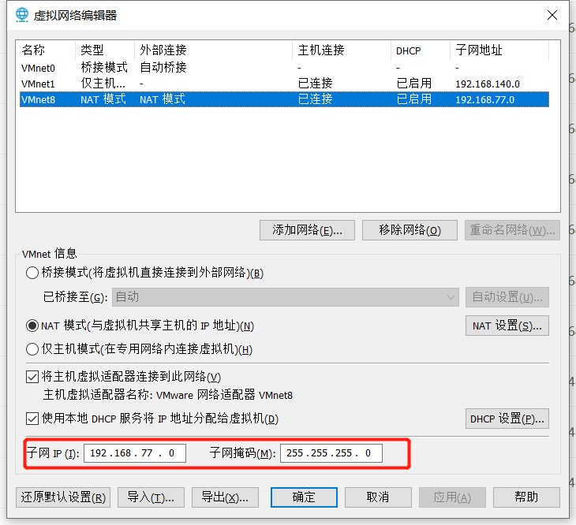
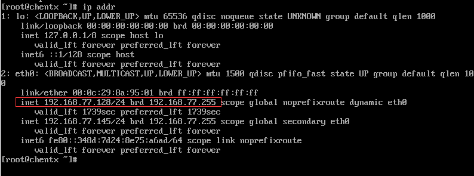
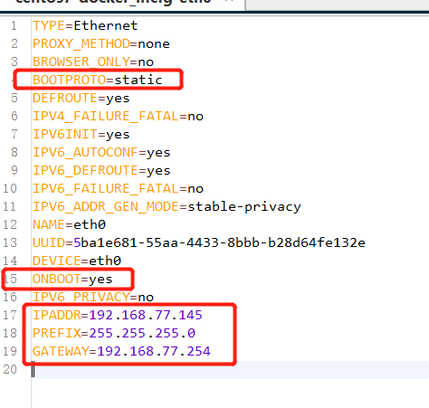
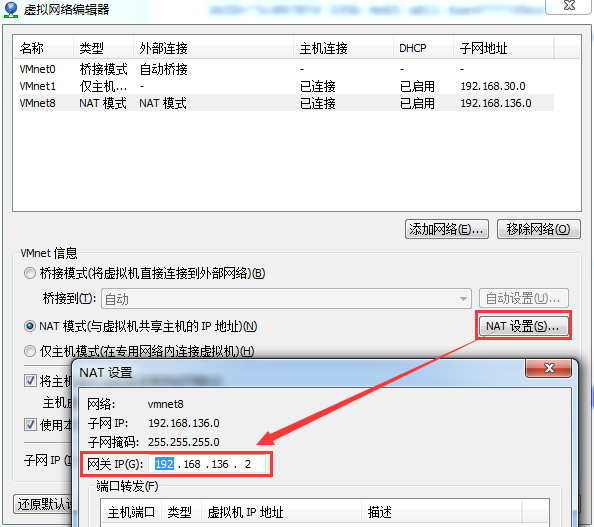

# 静态ip连接外网

## 1：确定子网ip和子网掩码

那么选的ip就要在  192.168.77.1到 192.168.77.254之间 子网掩码相同255.255.255.0

## 2.centos7.9使 ip addr查看虚拟机ip地址

## 修改网络配置

使用命令vi /etc/sysconfig/network-scripts/ifcfg-eth0 或者使用ssh工具查看网络配置文件，修改这些

BOOTPROTO：设置为静态ip <a name="aa">在这</a>

ONBOOT：是否自启动

IPADDR：就从刚才查看的范围内选一个

PREFIX：子网掩码

GATEWAY：网关，一般写和ip一直网段最后一个

或者

其中：

**IPADDR** 就是你执行ifconfig的时候输出的IP

**BROADCAST** 是广播地址，从[第1步](#1：确定子网ip和子网掩码)的"DHCP设置"界面获取

**NETMASK**是子网掩码，也从从[第1步](#1：确定子网ip和子网掩码)的"DHCP设置"界面获取

**GATEWAY**是网关，从vmware的虚拟网络编辑器的"NAT设置”里面获取

## 保存退出

重新运行网络

service network restart

<a href="#aa">第三种跳转  使用href标签+id名字  </a>

ping www.baidu.com

# docker安装

## 安装Docker

### 安装工具

sudo yum install -y yum-utils device-mapper-persistent-data lvm2

### .添加docker的yum库

yum-config-manager --add-repo http://mirrors.aliyun.com/docker-ce/linux/centos/docker-ce.repo
sudo yum makecache fast

### 安装Docker

sudo yum install docker-ce docker-ce-cli containerd.io

### 启动&开机启动

sudo systemctl start docker
systemctl enable docker

### 测试Docker

docker run hello-world

docker version

## docker 服务操作

启动docker：systemctl start docker
停止docker：systemctl stop docker
重启docker：systemctl restart docker
查看docker状态：systemctl status docker
开机启动：systemctl enable docker
查看docker概要信息：docker info
查看docker帮助文档：docker --help

## docker 镜像操作

docker images :查看本地镜像
docker search 镜像名：搜索远程镜像
docker rmi 镜像名:版本/imageId :删除指定镜像 

docker rmi 镜像号 --force 强制删除
docker rmi ‘docker images -q’ :删除所有镜像
docker pull 镜像名:版本 :拉取镜像
docker push 镜像：版本 ：推送镜像到远程

## docker 容器操作

运行交互式容器：
docker run -it --name=容器名 -p=linux端口:容器端口 -v=/linux目录：/容器目录 镜像名:版本 /bin/bash
运行守护式容器：
docker run -id --name=容器名 -p=linux端口:容器端口 -v=/linux目录：/容器目录 镜像名:版本
查看容器：docker ps -a
查看容器ID： docker ps -a -q
删除容器：docker rm 容器名
删除所有容器：docker rm docker ps -a -q
停止一个容器：docker kill 容器名
停止所有容器： docker kill docker ps -a -q
启动容器：docker start 容器名
重启容器：docker restart 容器名
进入容器：docker exec -it 容器名 /bin/bash ， 

退出容器 exit 或者ctrl + p + q (交互式容器建议使用)
拷贝文件到容器：docker cp /linux文件 容器:/容器目录
从容器拷贝文件到linux: docker cp 容器:/文件 /linux目录
查看IP： docker inspect 容器名
查看日志：docker logs 容器名.